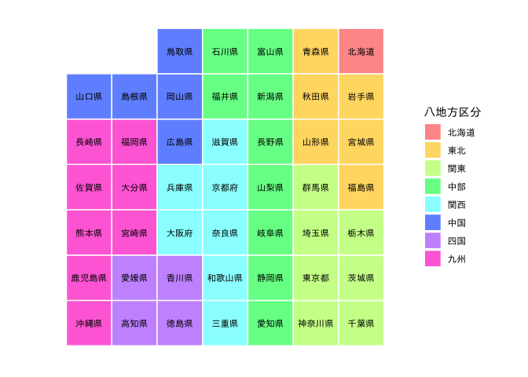

<!-- README.md is generated from README.Rmd. Please edit that file -->

# tabularmaps

<!-- badges: start -->

[](https://www.tidyverse.org/lifecycle/#experimental)
[](https://cran.r-project.org/package=tabularmaps)
[](https://github.com/uribo/tabularmaps/actions)
<!-- badges: end -->

tabularmapsは、CC0で公開されている[カラム地図プロジェクト](https://github.com/tabularmaps/hq)が進める行政区分等のグリッドレイアウトによる可視化をRパッケージとして提供するものです。

## インストール

インストールはGitHubを経由して行います。まずremotesパッケージをCRANからインストールした後、`remotes::install_github()`で行ってください。

``` r
install.packages("remotes")
remotes::install_github("uribo/tabularmaps")
```

## 使い方

``` r
library(tabularmaps)
library(ggplot2)
```

**日本国内**

47都道府県

``` r
tabularmap(jpn77, 
           x,
           y,
           group = prefecture,
           fill = region_kanji, 
           label = prefecture_kanji, 
           size = 3,
           family = "IPAexGothic") +
  theme_tabularmap(base_family = "IPAexGothic") +
  scale_fill_jpregion(lang = "jp",
                      name = "八地方区分")
```

 東京23区

``` r
tabularmap(tky23,
           x,
           y,
           group = ward,
           fill = ward,
           label = ward_kanji,
           family = "IPAexGothic",
           .expand_size = 12.5) +
  theme_tabularmap(base_family = "IPAexGothic") +
  guides(fill = FALSE)
```


**国際**

ISO-3166による国名

``` r
tabularmap(iso3166, 
           x,
           y,
           group = iso3c,
           fill = continent, 
           label = iso3c, 
           size = 2,
           .expand_size = 20, 
           .radius_size = 10) +
  theme_tabularmap() +
  guides(fill = guide_legend(title = "Continent")) +
  theme(legend.title = element_text(size = 10),
        legend.text = element_text(size = 8))
```


## Related works

  - [geofacet](https://github.com/hafen/geofacet)
  - [ggpol](https://github.com/erocoar/ggpol)
  - [statebins](https://github.com/hrbrmstr/statebins)
  - [waffle](https://github.com/hrbrmstr/waffle)
